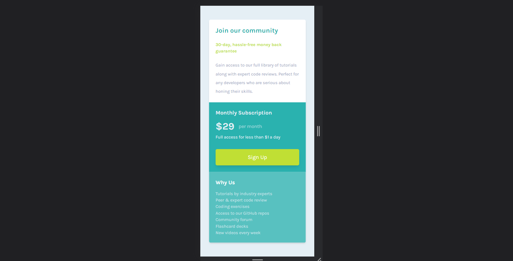

# Frontend Mentor - Single price grid component solution using NEXTJS 13 and Tailwind CSS

This is a solution to the [Single price grid component challenge on Frontend Mentor](https://www.frontendmentor.io/challenges/single-price-grid-component-5ce41129d0ff452fec5abbbc). Frontend Mentor challenges help you improve your coding skills by building realistic projects. 

## Table of contents

- [Overview](#overview)
  - [The challenge](#the-challenge)
  - [Screenshot](#screenshot)
  - [Links](#links)
- [My process](#my-process)
  - [Built with](#built-with)
  - [What I learned](#what-i-learned)
- [Author](#author)

## Overview

### The challenge

Users should be able to:

- View the optimal layout for the component depending on their device's screen size
- See a hover state on desktop for the Sign Up call-to-action

### Screenshot




### Links

- Live Site URL: [unavailable]()

## My process

### Built with

- Semantic HTML5 markup
- CSS custom properties
- Flexbox
- CSS Grid
- Mobile-first workflow
- [React](https://reactjs.org/) - JS library
- [Next.js](https://nextjs.org/) - React framework

### What I learned

Applying Font if using Turbopack NextJS 13. As next@13.0.6, turbopack can't apply font family either in development or at production. I have to put google font link in ```<head>``` and a little bit setting and boom. the font display correctly.


### Useful resources

- [Turbopack setting](https://blog.theashishmaurya.me/using-tailwind-css-in-nextjs-13-with-turbopack) - This helped me for installing nextjs 13 using turbopack and tailwind.

## Author

- Github - [fiqihalfito](https://www.github.com/fiqihalfito)
- LinkedIn - [fiqih-alfito](https://www.linkedin.com/in/fiqih-alfito)
